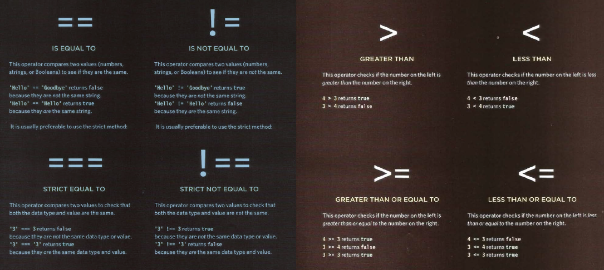
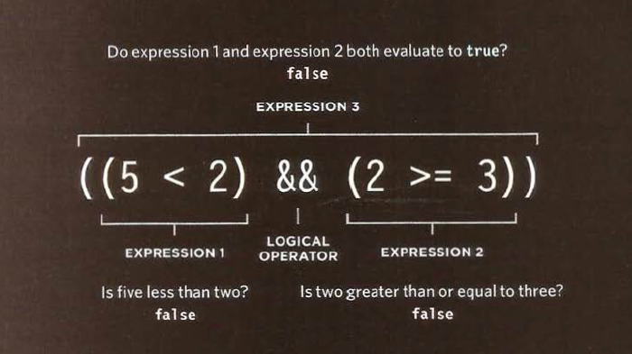

<!-- 
and logical operators
Evaluating conditions  -->
# comparison Operators:
###  Comparison operators usually return single values of **true** or **false**.

# Logical operators
### Logical operators allow you to compare the results of more than one comparison operators.

## Types of logical operators:
  - 1-	&& Logical **AND**
 
| AND | T | F |
|:---:|:-:|:-:|
| T | T | F |
| F | F | F |

  - 2- || Logical **OR**
Table
  - 3-	! Logical **NOT**
> **_Logical expressions are evaluated left to right._**
# Loops
### Loops check conditions. If it returns true , acode block will run.
Then the condition will be checked again and if it returns true,the code block will run again. It repeats until the condition returns false.

Types of loop:
1-	FOR 
Use For loop if you want the code to run a specific number of times
2-	WHILE
If you do NOT know now many times the code should run, you can use a while loo. Here the condition can be something other than a counter
3-	DO WHILE 
The do … while loop is very similar to the while loop, but has one key defference: it will always run the statmenets inside the curle braces at least once, EVEN if the condition evaluates to false.

	All loops contain thee main elements:
1-	Initialization
2-	Condition
3-	Update 

